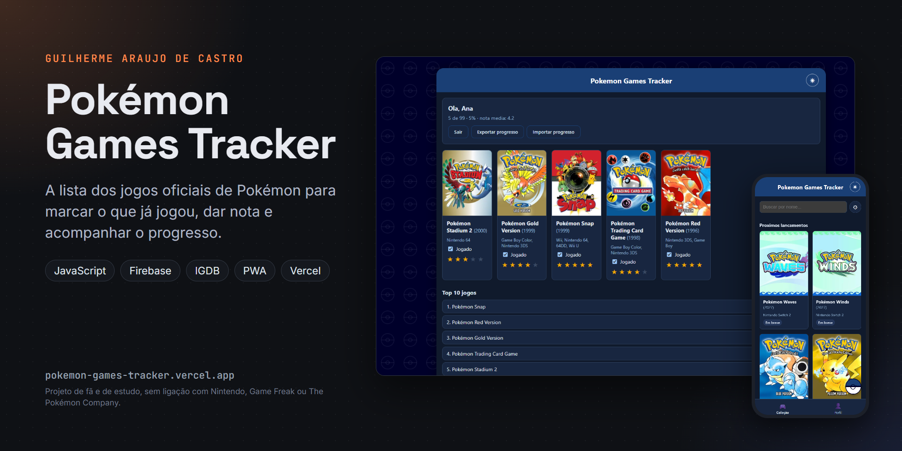
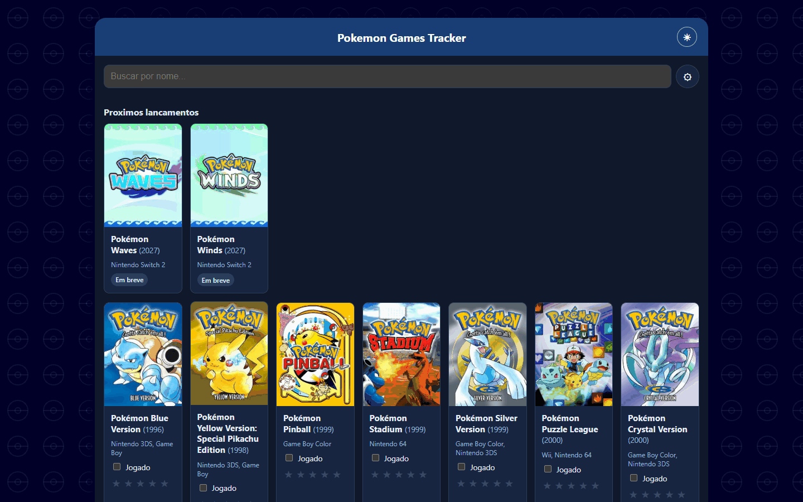
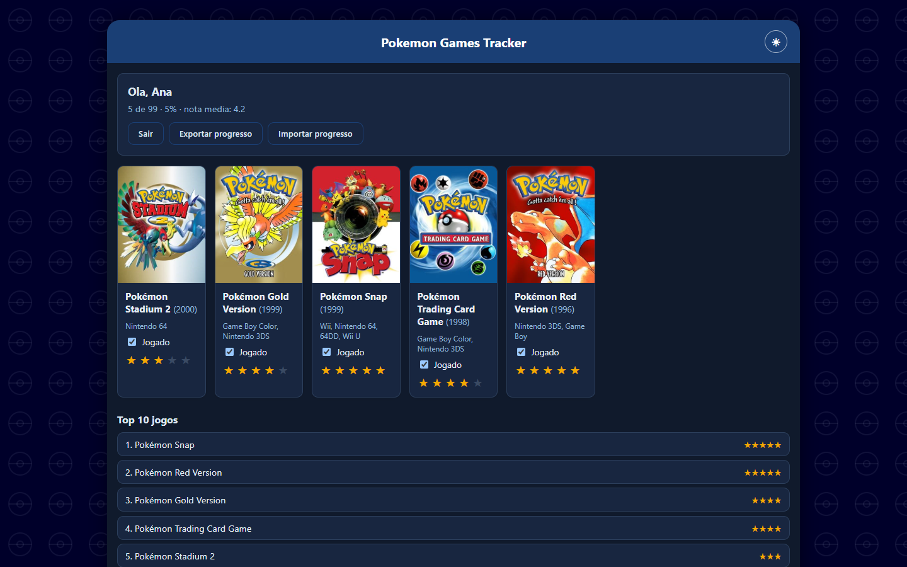
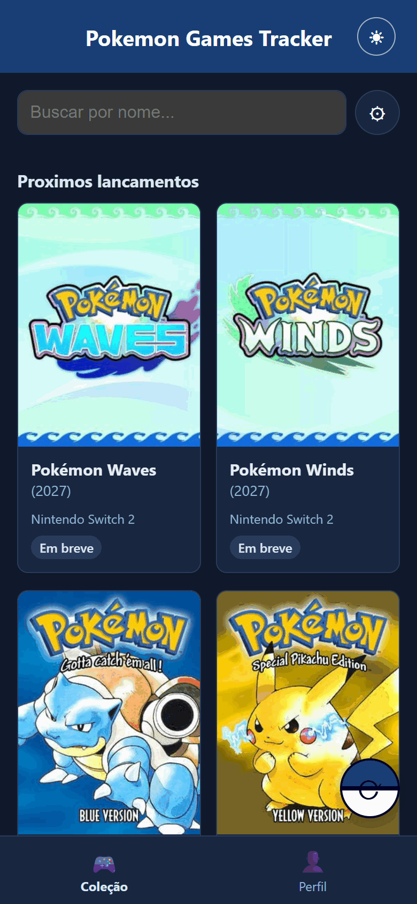

# Pokémon Games Tracker



Lista dos jogos oficiais de Pokémon pra marcar os que você já jogou, dar nota e acompanhar o progresso. Os dados dos jogos vêm da IGDB.

Site: https://pokemon-games-tracker.vercel.app

[](https://github.com/GuilhermeAraujoDeCastro/pokemon-games-tracker/actions/workflows/ci.yml)

| Coleção | Perfil e estatísticas | No celular |
|---|---|---|
|  |  |  |

## O que tem

- Lista com capa, ano e plataformas de cada jogo, busca, filtro por ano, por plataforma e por não jogados, e ordem alfabética ou por ano.
- Seções separadas pros jogos zerados, os que faltam e os que ainda vão lançar.
- Ficha de cada jogo com resumo, plataformas e nota de 1 a 5.
- Estatísticas: jogos mais bem avaliados, distribuição das notas, jogos por geração e quantos anos depois do lançamento você costuma zerar um jogo.
- Modo visitante, que guarda tudo no próprio navegador, sem conta.
- Login com Google ou e-mail pelo Firebase, pra levar o progresso pra outros aparelhos.
- Link público só leitura (`?share=`) pra mostrar seu progresso pra alguém.
- Backup do progresso em arquivo e importação de volta.
- Tema claro e escuro, layout pra celular e instalação como app (PWA).

## Só jogos oficiais

A busca da IGDB por "pokemon" devolve ROM hacks, jogos de fã e coletâneas junto com os jogos da Nintendo. O `js/igdb.js` filtra pelo tipo de jogo e pelas empresas envolvidas, e só passa o que foi feito ou publicado pelas empresas oficiais da franquia.

A IGDB exige um Client Secret da Twitch, que não pode aparecer no navegador. Por isso a busca passa por uma function da Vercel (`api/igdb-search.js`): ela guarda o segredo, reaproveita o token enquanto está ativa, tenta de novo quando o token expira e limita pedidos repetidos.

## Tecnologias

JavaScript puro em módulos ES, sem framework. Firebase Authentication e Firestore guardam as contas; o modo visitante usa `localStorage`. O Sentry é opcional, pra acompanhar erros em produção.

No build, os nomes internos do JavaScript são encurtados e o JS, o CSS e o HTML saem minificados, o que deixa os arquivos menores. Isso não protege nada: qualquer pessoa ainda consegue ler o que roda no navegador. O que é segredo de verdade (o Client Secret da IGDB) fica só na function da Vercel.

## Estrutura

```
pokemon-games-tracker/
├── index.html
├── sw.js                  service worker (cache offline)
├── manifest.json
├── firestore.rules        regras de segurança do banco
├── vercel.json
├── api/
│   └── igdb-search.js     proxy da IGDB
├── css/
├── js/
│   ├── main.js            liga a tela aos módulos
│   ├── igdb.js            busca e filtro dos jogos oficiais
│   ├── filters.js, progress.js, ratings.js, stats.js
│   ├── storage-local.js   modo visitante
│   ├── firebase-app.js    login e dados na nuvem
│   ├── backup.js
│   └── config.example.js  modelo das chaves
└── scripts/               build e servidor local
```

## Rodando na sua máquina

```bash
npm install
npm run dev
```

O servidor local serve o site, mas a busca de jogos depende da function `api/igdb-search.js`, que só roda na Vercel (ou com `vercel dev`, com as variáveis da IGDB configuradas). Pro login, copie `js/config.example.js` pra `js/config.js` e preencha com os dados do seu projeto Firebase.

O GitHub Actions roda o build de produção a cada push, com chaves falsas, pra pegar erro antes da Vercel.

## Deploy na Vercel

Variáveis de ambiente do projeto:

- `IGDB_CLIENT_ID` e `IGDB_CLIENT_SECRET`: criados em dev.twitch.tv, na aba Applications.
- `FIREBASE_API_KEY`, `FIREBASE_AUTH_DOMAIN`, `FIREBASE_PROJECT_ID`, `FIREBASE_STORAGE_BUCKET`, `FIREBASE_MESSAGING_SENDER_ID`, `FIREBASE_APP_ID`: o build gera o `js/config.js` com elas.
- opcional: `SENTRY_DSN`.

As regras do Firestore ficam em `firestore.rules` e precisam ser publicadas no Firebase Console (Firestore Database, Regras).

## Créditos e avisos

Dados da IGDB, acessada pela API da Twitch; detalhes em [CREDITS.md](CREDITS.md). Pokémon é marca da Nintendo, da Game Freak e da Creatures Inc. Este é um projeto de fã e de estudo, sem fins lucrativos e sem ligação com essas empresas.

## Licença e contato

Código sob a licença MIT (veja [LICENSE](LICENSE)). Feito por Guilherme Araujo de Castro: [portfólio](https://guilhermearaujodecastro.vercel.app) · [LinkedIn](https://www.linkedin.com/in/guilherme-araujo-de-castro) · guilhermeacastro.2006@gmail.com
